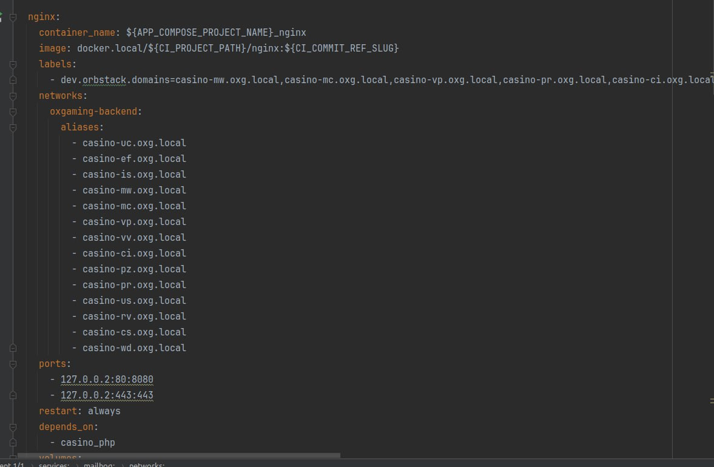
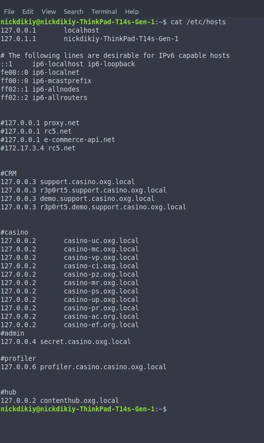

Move to DNS local name instead of using tcp port




```yaml
version: "3"

networks:
  oxgaming-backend:
  name: 'oxgaming-backend'
  driver: bridge

services:
    web:
      networks:
        - oxgaming-backend
```

___________________________________________

log module which will send error message to slack/telegram/signal

___________________________________________

google auth
___________________________________________

use .env variable on deploy workflow
